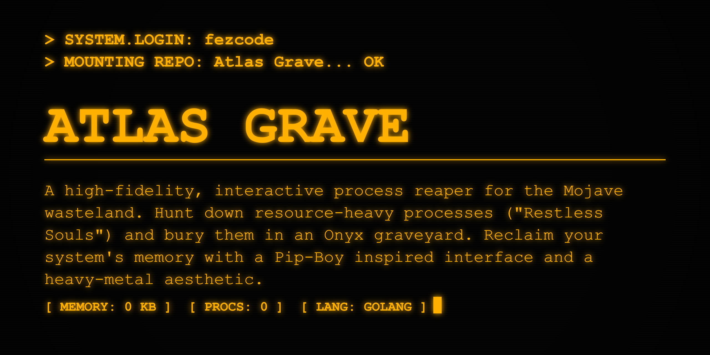

# atlas.grave 💀🗡️



**atlas.grave** is a high-fidelity, interactive process reaper. Part of the **Atlas Suite**, it allows you to hunt down resource-heavy processes ("Restless Souls") and bury them in an Onyx graveyard with a Pip-Boy inspired interface.


## ✨ Features

- 💀 **Interactive Reaper:** Scroll through your running processes and select targets.
- 🔥 **Restless Souls:** Automatically highlights processes with high CPU or Memory usage.
- 📟 **Amber CRT Aesthetic:** Rugged Pip-Boy 3000 inspired TUI.
- 📊 **Reclamation Log:** Tracks how much "Burden" (RAM) you've reclaimed in your session.
- 📦 **One-Key Installation:** Managed via `atlas.hub`.

## 🚀 Installation

### Recommended: Via Atlas Hub
```bash
atlas.hub
```
Select `atlas.grave` from the list and confirm.

### From Source
```bash
git clone https://github.com/fezcode/atlas.grave
cd atlas.grave
gobake build
```

## ⌨️ Usage

Simply run the binary to enter the graveyard:
```bash
./atlas.grave
```

### Controls
| Key | Action |
|-----|--------|
| `↑/↓` / `j/k` | **Navigate:** Move through the list of souls. |
| `Enter` / `b` | **Bury:** Terminate the selected process (requires confirmation). |
| `q` / `Ctrl+C` | **Exit:** Leave the graveyard. |

## 📄 License
MIT License - see [LICENSE](LICENSE) for details.
